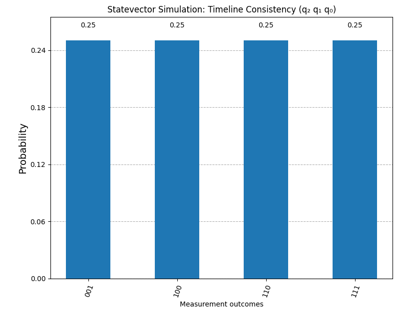

# Quantum Statevector Simulation for simulating Quantum Ambiguity Resolution in Natural Language (Qiskit)

This is an ideal quantum circuit that models quantum ambiguity resolution using three qubits, each encoding a specific logical role:
	Qubit 0 (q_0) — Indicates whether an ambiguous linguistic input is present (1 = ambiguity; 0 = unambiguous).
	Qubit 1 (q_1) — Indicates whether a disambiguation strategy (e.g., semantic context, grammar rules, statistical inference) has been applied (1 = resolution attempted; 0 = no resolution).
	Qubit 2 (q_2) — Encodes whether the overall interpretation is logically coherent (1 = consistent; 0 = contradiction detected).


---

## Features

-  3-qubit quantum circuit
-  Statevector simulation using `Statevector.from_instruction`
-  Visualization of output state probabilities
-  Clean matplotlib histogram plot

---

## Circuit Overview

```plaintext
  q0: ──H─■────■────
           │      │
  q1: ──H──X──X───■───
                 │
  q2: ──X─────────X───
```

- Qubit 2 is initialized to `|1⟩`
- Bell pair created between `q0` and `q1`
- Toffoli (CCX) gate with `q0`, `q1` controlling `q2`

---

## Requirements

Install dependencies:

```bash
pip install qiskit matplotlib
```

---

## How to Run

Save the code as `statevector_simulation.py`, then run:

```bash
python statevector_simulation.py
```

This will:
1. Construct the quantum circuit (without measurement)
2. Simulate it using the statevector
3. Plot a histogram of the quantum state's probabilities

---

## Output Example

The output is a histogram of quantum state probabilities:



Each state is labeled in **little endian** format (`q2 q1 q0`), consistent with Qiskit's output conventions.

---

## License

MIT License. See the [LICENSE](LICENSE) file for details.

---

## Contributions

Contributions and suggestions are welcome via pull requests or issues.

---

## Contact

Questions? Reach out via [GitHub Issues](https://github.com/your-username/your-repo/issues).

